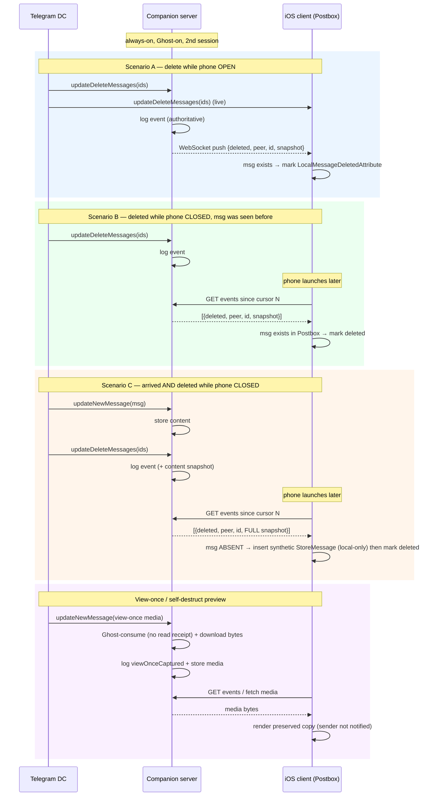

# AyuGram feature port — design & implementation notes

Design notes for porting AyuGram-style features (Ghost Mode + message
preservation) onto this Swiftgram / telegram-ios fork. This documents
**what to change, where, and why**, with concrete code seams. It is a
living design doc, not a spec — verify each seam on device.

> **Status.** Sections 1–4 are built and device-verified; they are kept in
> their original planning voice because the *reasoning* is still the useful
> part. What actually shipped, including the features that were never in
> the original plan and the traps that only appeared on device, is in
> **section 6**. Read section 6 for the current state of the app; read
> 1–4 for why it is shaped that way.

> Architectural principle: telegram-ios `Postbox` is already a durable,
> SQLite-backed store of every message. Unlike AyuGram Desktop (tdesktop
> keeps messages in memory and therefore needs its own `ayudata.db`), we
> should **reuse Postbox** — preserve messages by *not deleting them*, and
> attach local-only `MessageAttribute`s. No shadow database.
>
> AyuGram Desktop/Android are GPLv3: borrow **ideas and data models**,
> reimplement in Swift — do not copy code verbatim.

---

## 1. Ghost Mode

All gates read `SGSimpleSettings.shared.ghostMode`. The flag lives in
`Swiftgram/SGSimpleSettings/Sources/SimpleSettings.swift`
(`Keys.ghostMode`, default `false`, `@UserDefault` property) and the UI
toggle in `Swiftgram/SGSettingsUI/Sources/SGSettingsController.swift`
(section `.ghostMode`, `SGBoolSetting.ghostMode`, handled in the
`updateBoolSetting` switch).

### 1.1 Currently gated (verified in code)

| Signal | Sole network sender | Seam | Status |
|---|---|---|---|
| Online status (`account.updateStatus`) | `ManagedAccountPresence.swift:48` | `effectiveIsOnline = isOnline && !ghostMode` | OK — single choke point |
| Typing (`messages.setTyping`) | `ManagedLocalInputActivities.swift:147` | early `return .complete()` | OK — single choke point |
| Voice/video/view-once "seen" (`readMessageContents`) | `MarkMessageContentAsConsumedInteractively.swift:42` | skip `addSynchronizeConsumeMessageContentsOperation` | OK — single choke point |
| Read receipts (in-chat) | `ChatHistoryListNode.swift:4542` | skip `installInteractiveReadMessagesAction` | Partial — see 1.2 |

Note: the gate at `ApplyMaxReadIndexInteractively.swift:68` only guards a
**local** notification (`notifyAppliedIncomingReadMessages`), not a network
send. It is effectively cosmetic; the real in-chat read suppression is the
`ChatHistoryListNode` gate.

### 1.2 Read receipts — hardening TODO

The read protection is **shallow**: it works only because
`ChatHistoryListNode` does not *trigger* auto-read while viewing. The actual
network read (`messages.readHistory` / `channels.readHistory`) is sent from
`SynchronizePeerReadState.swift` (and directly from a few others) and is
**not** gated. Secondary triggers therefore still leak a read receipt:

- Mark-as-read from a **push notification** — `AppDelegate.swift:2960`
- **Apple Watch** — `WatchRequestHandlers.swift:125`
- **Siri** — `SiriIntents/IntentHandler.swift:632`
- **"Mark all as read"** — `MarkAllChatsAsRead.swift`
- Reply threads — `ReplyThreadHistory.swift:370`

**Fix:** add a `ghostMode` gate at the network choke point in
`SynchronizePeerReadState.swift` (skip the `readHistory` request). One place
closes all callers.
**Caveat:** if you suppress the network read but still zero the local unread
counter, the server disagrees and the badge may reappear on next resync.
Decide whether to also keep the local unread state untouched.

### 1.3 Other ghost gaps

- **Reactions / poll votes "seen"** — `installInteractiveReadReactionsAction`
  (`InstallInteractiveReadMessagesAction.swift:222`) is not gated. Minor leak.
- **Story views** — not gated. Deprioritized: Premium Stealth Mode covers it.
  If ever added: gate `readStories` / `incrementStoryViews`
  (`ManagedSynchronizeViewStoriesOperations.swift`, `Stories.swift`).
  Server limitation: reacting/replying to a story still registers the view.

### 1.4 Granularity TODO

AyuGram exposes ~9 independent toggles (Don't Read, Don't Send Online, Don't
Send Typing, Schedule Messages, Read on Interact, …). We currently have a
single `ghostMode` flag. Recommended: split into sub-settings in
`SGSimpleSettings` and present them under a `.disclosure` → dedicated screen
of toggles. The gating mechanics already exist; this is a settings refactor.

### 1.5 Invisible send (schedule)

Sending a message **forces you online server-side** — this cannot be gated
like read/typing. The only workaround is delayed delivery via `schedule_date`
(AyuGram uses ~12 s for text, dynamic for media). Implement in the send path
(`EnqueueMessage.swift` / TelegramCore pending-message pipeline): when ghost
"invisible send" is on, route the message through scheduled-messages
transparently so it does not bump presence. Expect a delay; buggy on poor
networks (AyuGram warns the same).

---

## Delivery architecture — companion capture server (READ FIRST for class B)

> **This section supersedes the on-device delivery mechanism for class B
> (deletions, edits, media, view-once).** The Postbox seams documented in
> §§2–4 remain valid as *materialization / rendering* mechanics, but the
> **capture** of destructive events no longer happens on the phone — it
> happens on an always-on companion server. Read this before implementing
> §§2–4.

### A. Why the phone cannot capture reliably (the iOS constraint)

Deleted/edited events arrive as MTProto updates (`updateDeleteMessages`,
`updateEditMessage`) that are only processed while a **live session is
running**. On iOS the app is suspended/killed in the background, so:

- **Mute is server-side** — the server decides whether to send a push at all;
  the client cannot influence it.
- **Push is server-driven** — Telegram's server emits the APNs push; the NSE
  only *decrypts* it. We cannot force iOS to wake the NSE, and muted chats get
  no push, so there is no background wake for them.
- **Abusing background modes** (location / VoIP "call" keep-alive) drains
  battery, is fragile, and gets the app rejected/killed by Apple — dead end.
- A Telegram-app crash resets any in-app capture state.

Conclusion: the "message received *and* deleted while the app was fully
closed" case (scenario C below) is **unsolvable on-device**. The fix is to
move capture off the phone entirely.

### B. Topology — an always-on second session

The companion server is a **second authorized session of the user's own
account** (a userbot on the same phone number — *not* a separate bot account,
which would only see chats it joined). Being a full MTProto client, it can
itself run Ghost Mode (suppress read/consume), so it captures view-once /
self-destruct media **without notifying the sender**.

```
            updateNewMessage / updateDeleteMessages / updateEditMessage
   ┌──────────────────┐  (live, always-on — sees EVERYTHING the account sees)
   │  Telegram DC      │◀────────────────────────────────────────────┐
   └──────────────────┘                                               │
        ▲   │ normal sync (pts/difference, APNs push)                 │
        │   ▼                                                          │
   ┌──────────────────┐                          ┌────────────────────┴───────┐
   │  iOS client       │                          │  Companion server           │
   │  (this fork)      │                          │  (VPS or home PC)           │
   │                   │                          │  · 2nd session, Ghost-on    │
   │  · Postbox (norm. │   WebSocket push +       │  · content store (rolling,  │
   │    messages)      │◀──── gap-sync REST ─────▶│    ayudata.db-analog)       │
   │  · overlay render │   (events since cursor)  │  · append-only event log    │
   └──────────────────┘                          └─────────────────────────────┘
```

**Key invariant:** the server is an independent session, so it receives every
update **even while the phone is open**. → *The server is the single
authoritative, complete source of destructive events.* Any on-device capture
(the §2 Postbox seam) is only a latency optimization layered on top, never the
source of truth. For v1 we skip the on-device seam entirely.

### C. Server-side data model

The delete update carries **only message IDs, not content** — so to know *what*
a deleted message contained, the server must have stored it when it first
arrived (same reason AyuGram Desktop needs `ayudata.db`; here it stays
server-side, the phone never pulls the full history).

- **Content store** — rolling copy of messages the account has seen
  (`peerId, msgId → {text, media refs, date, author, …}`). Retention policy
  configurable.
- **Event log** — append-only, monotonic cursor per account:
  `{seq, peerId, msgId, type: deleted|edited|viewOnceCaptured, payload}`.
  `payload` for `edited` = prior `{text,date}`; for `deleted` = a snapshot ref
  into the content store; for `viewOnceCaptured` = stored media ref.

### D. Client sync + materialization

Rendering reads **only Postbox** — it never cares who captured the event. The
client keeps a `lastServerCursor`. Two triggers pull events:

1. **On launch / foreground** — REST: "give me events after `lastServerCursor`
   for my peers" → gap-fill.
2. **While open** — WebSocket push → near-real-time (replaces the need for an
   on-device seam in v1).

For each event the client **materializes** into Postbox:

- **Message exists in Postbox** (scenarios A/B — phone saw it once) → attach
  `LocalMessageDeletedAttribute` / append `LocalMessageEditHistoryAttribute`
  (the §2/§2.3 mechanics).
- **Message absent** (scenario C — arrived *and* deleted while phone was off) →
  **insert a synthetic `StoreMessage` from the server's content snapshot, then
  mark it deleted.** ⚠️ This synthetic row **must be flagged local-only** so
  Telegram's `pts`/`difference` reconciliation never tries to fetch, dedupe, or
  overwrite it. This is the one genuinely delicate seam of the whole design.

### E. Sequence — the three scenarios + view-once



### F. Division of responsibility

| Feature | Where |
|---|---|
| Ghost (online/typing/read/consume, invisible send) | **client** (existing seams §1) |
| Capture of deletions / edits / view-once | **server** (authoritative) |
| Content retention (to resolve deletes) | **server** (rolling store) |
| Media download-before-expiry | **server** (has time/bandwidth; NSE cannot) |
| Materialization into Postbox + rendering | **client** (§D; §2.4 rendering) |
| On-device foreground capture (Postbox seam §2.2) | **optional later optimization**, not v1 |

### G. Open decisions (block server spec)

1. **Host:** home PC (free; downtime = capture gaps, NAT/dynamic IP) **vs**
   VPS (~$5/mo, always-on, static IP but datacenter-IP logins are more likely
   to trip Telegram's session-security flags).
2. **Stack:** Telethon / Pyrogram (Python — native `on_deleted_messages` /
   `on_edited_message`, fastest to prototype) **vs** TDLib (C++, heavier).
3. **Client↔server protocol:** REST for gap-sync + WebSocket for live push;
   auth via a pairing token.
4. **ToS/trust:** an automated 2nd session capturing view-once is a grey area
   (same as AyuGram); the user's account, the user's risk. Deleted-message
   content now lives on an external server → encrypt at rest, decide the trust
   boundary (personal use = acceptable).

### H. Update capture mechanics — how the server "listens"

> **Not packet sniffing.** MTProto transport is encrypted with the session
> `auth_key`; there is nothing to sniff. The server receives events as a
> **legitimate authorized client** via the MTProto *Updates* stream — i.e. it
> *subscribes* to updates, exactly like every anti-delete bot does. "Listening"
> = keeping a live update loop running, not intercepting traffic.

**The Updates mechanism:**

1. After login the client holds a **persistent TCP connection** to a DC.
2. Telegram **pushes `Updates` objects** over it: `updateNewMessage`,
   `updateDeleteMessages`, `updateEditMessage`, plus channel variants
   `updateNewChannelMessage` / `updateDeleteChannelMessages` /
   `updateEditChannelMessage`.
3. Integrity is tracked by **`pts` / `qts` / `seq` / `date`**; updates carry
   `pts` + `pts_count` and must be applied in order.
4. On a gap (reconnect / prior downtime) the client calls
   **`updates.getDifference`** (common box) and **`updates.getChannelDifference`**
   (per channel) to catch up — this is the server-side "gap-sync".

Two independent boxes matter to us:
- **DMs / basic groups** → deletions arrive as `updateDeleteMessages` (common pts).
- **Channels / supergroups** → `updateDeleteChannelMessages` (per-channel pts).

**⚠️ Caveat 1 — a delete update carries only message IDs, no content.** To know
*what* a deleted message was, the server must have stored it on arrival
(`on_message` → content store). This is *the* reason the rolling content store
(§C) is mandatory, not optional.

**⚠️ Caveat 2 — long downtime loses explicit deletes.** After a long offline
window `getDifference` / `getChannelDifference` may return
**`differenceTooLong` / `channelDifferenceTooLong`**: Telegram then does NOT
replay each delete — it just hands a new `pts` + a current slice. Deletions that
happened during the gap arrive as **no event at all**; the only way to detect
them is to **diff the stored ID set against the refetched slice** and compute
"missing" (extra reconciliation logic). → **Server uptime is critical**: short
reconnects are handled by the library's `getDifference`; multi-hour downtime =
a capture hole. This is a concrete argument for a VPS over a home PC.

**Per-stack:**

- **Pyrogram** — `@on_message` (cache content), `@on_deleted_messages`
  (gives Message objs = essentially `id` + `chat`, no content → look up in your
  store), `@on_edited_message`.
- **Telethon** — `events.NewMessage` / `events.MessageDeleted` /
  `events.MessageEdited`. Nuance: `MessageDeleted` sometimes has an **unknown
  `chat_id`** (DMs) → maintain an ID→chat index to resolve it.
- **TDLib** — `updateNewMessage` / `updateDeleteMessages` (with `is_permanent`)
  / `updateMessageContent`. Keeps its own DB, gives a bit more, but delete is
  still just IDs. Heaviest to integrate.

In all three, "listening" = keep the update loop always running; the library
handles reconnect + `getDifference` (subject to Caveat 2).

**Server hardening checklist:**

- **Persist `pts`/state to disk** so a process restart resumes via
  `getDifference` instead of starting cold.
- **`FLOOD_WAIT_x` backoff** when fetching content/media (esp. the
  download-before-expiry media path).
- **Session-kill handling** (`AUTH_KEY_UNREGISTERED`) — Telegram may terminate
  the session (more likely on datacenter IPs) → re-auth flow.
- **Apply in `pts` order** so a delete never precedes the new-message it refers
  to on reconnect.

---

## 2. Message preservation (deleted / edited) — "class B"

> **Delivery note:** capture is handled by the companion server (see
> *Delivery architecture* above). The mechanics below apply to the
> **materialization / rendering** step on the client — §2.2's
> `markMessagesDeletedLocally` is what the client runs when applying a
> server-pushed event to Postbox, with the scenario-C "insert-then-mark"
> variant added.

The flagship feature. Preserve messages that the server deletes or edits by
**not applying the destructive operation** and instead attaching local-only
attributes, then rendering them specially.

### 2.1 Data model — two local `MessageAttribute`s

Model after existing attributes in
`submodules/TelegramCore/Sources/SyncCore/SyncCore_*MessageAttribute.swift`.

- `LocalMessageDeletedAttribute` — flag + deletion timestamp. Its presence
  means "server deleted this; we kept it."
- `LocalMessageEditHistoryAttribute` — array of prior versions
  `[{ text, date }]` (+ media ref later).

Both are **local-only** (never serialized to the network).
**Required:** register each new attribute type in the Postbox attribute
decoder, or decoding crashes at read time. This is not optional.

### 2.2 Seam 1 — deletion

Incoming server deletions are queued in `AccountStateManagementUtils.swift`
(`updateDeleteMessages` → `updatedState.deleteMessages(...)` at ~955/1045/3503)
as `.DeleteMessages([MessageId])` operations, then **replayed** into the
Postbox transaction at:

`AccountStateManagementUtils.swift:4421`
```swift
case let .DeleteMessages(ids):
    if SGSimpleSettings.shared.preserveDeleted {
        markMessagesDeletedLocally(transaction: transaction, ids: ids) // add attribute, keep row
    } else {
        _internal_deleteMessages(transaction: transaction, mediaBox: mediaBox, ids: ids, ...)
    }
```

**Also gate the resync deletions** or preserved messages vanish on scroll /
gap-fill (this is the #1 bug of such features):
- `HistoryViewStateValidation.swift:987`
- `HistoryViewStateValidation.swift:1170`

Out of initial scope: `.DeleteMessagesWithGlobalIds` (`:4412`, secret/outgoing).

#### `markMessagesDeletedLocally`

The whole point is to keep the message **byte-for-byte** and change only the
attribute list. Rebuild the `StoreMessage` carrying every field verbatim (same
idiom as `MarkMessageContentAsConsumedInteractively.swift`), appending our
attribute:

```swift
import Postbox

func markMessagesDeletedLocally(transaction: Transaction, ids: [MessageId]) {
    // Match the codebase's "now" idiom (not Date()).
    let now = Int32(CFAbsoluteTimeGetCurrent() + NSTimeIntervalSince1970)

    for id in ids {
        guard let message = transaction.getMessage(id) else {
            continue // nothing to preserve
        }
        // Idempotent: the same delete update can be replayed; don't double-mark.
        if message.attributes.contains(where: { $0 is LocalMessageDeletedAttribute }) {
            continue
        }
        // TODO (caveat 2.5.1): skip IDs you deleted yourself (own "delete for everyone"
        // echoes back through this same update). Check a recently-locally-deleted set here.

        transaction.updateMessage(id, update: { currentMessage in
            var attributes = currentMessage.attributes
            attributes.append(LocalMessageDeletedAttribute(deletedAt: now))

            // forwardInfo must be re-wrapped into its Store* form; carry every subfield.
            var storeForwardInfo: StoreMessageForwardInfo?
            if let forwardInfo = currentMessage.forwardInfo {
                storeForwardInfo = StoreMessageForwardInfo(
                    authorId: forwardInfo.author?.id,
                    sourceId: forwardInfo.source?.id,
                    sourceMessageId: forwardInfo.sourceMessageId,
                    date: forwardInfo.date,
                    authorSignature: forwardInfo.authorSignature,
                    psaType: forwardInfo.psaType,
                    flags: forwardInfo.flags
                )
            }

            // Everything below is copied as-is; only `attributes` changed.
            return .update(StoreMessage(
                id: currentMessage.id,
                customStableId: nil,                       // Postbox keeps the stable id itself
                globallyUniqueId: currentMessage.globallyUniqueId,
                groupingKey: currentMessage.groupingKey,   // album grouping
                threadId: currentMessage.threadId,
                timestamp: currentMessage.timestamp,       // keep original position in history
                flags: StoreMessageFlags(currentMessage.flags),
                tags: currentMessage.tags,
                globalTags: currentMessage.globalTags,
                localTags: currentMessage.localTags,
                forwardInfo: storeForwardInfo,
                authorId: currentMessage.author?.id,
                text: currentMessage.text,
                attributes: attributes,                    // <-- the only change
                media: currentMessage.media                // keep media descriptor (bytes stay in MediaBox)
            ))
        })
    }
}
```

Why carry each field verbatim: dropping or altering any of them (timestamp,
flags, tags, grouping, forwardInfo, media…) would silently mutate the
preserved message — wrong position, broken album, lost forward header, etc.
The safe rule is "copy all, change one."

**What we deliberately DON'T do** — the work `_internal_deleteMessages` would
have done (unread-count decrement, tag summaries, thread stats, reply-reference
and media cleanup). Because we **keep the row**, the message genuinely still
exists, so counters/stats stay internally consistent on their own — we do NOT
need to replicate that cleanup. The real risks are elsewhere: resync
re-deletion (gate `HistoryViewStateValidation` above) and own-deletion dedup
(caveat 2.5.1) — not counter drift.

### 2.3 Seam 2 — edit

Edits arrive as `updateEditMessage` (`AccountStateManagementUtils.swift:1052`),
build a `StoreMessage`, and are queued via `updatedState.editMessage(...)`
(`:1069`) as `.EditMessage(MessageId, StoreMessage)`
(`AccountIntermediateState.swift:68`), replayed in the same switch.

Interception: in the replay of `.EditMessage`, **before overwriting**, read
the current message from the transaction; if the text changed, append the old
`{text, date}` to `LocalMessageEditHistoryAttribute` and carry the attribute
onto the new stored message. Gate behind `preserveEdits`.

### 2.4 Rendering / UI

- **Deleted:** message stays in the history view (we didn't delete it). In the
  bubble, detect `LocalMessageDeletedAttribute` and render a "deleted"
  label / tint. Nearly free.
- **Edit history:** add a "View edit history" action to the edited-message
  context menu, reading `LocalMessageEditHistoryAttribute`.
- **"Deleted" screen (per chat):** to avoid scanning the whole DB, attach a
  **custom Postbox tag** when marking deleted, then query by that tag.

### 2.5 Caveats (must handle)

1. **Own vs others' deletions.** The `.DeleteMessages` seam catches
   server-pushed deletions (mostly "someone else deleted"), but your own
   "delete for everyone" echoes back through the same update. Keep a set of
   recently locally-deleted IDs (from `DeleteMessagesInteractively.swift`) and
   skip preserving those.
2. **`_internal_deleteMessages` side effects.** It cleans unread counts, thread
   stats, reply refs, media. Skipping it keeps the message "live" in its slot —
   mostly fine, but verify counters on edge cases.
3. **Storage growth.** Preserved deletions accumulate — provide a cleanup UI /
   retention policy.
4. **Auto-delete / TTL messages** flow through
   `ManagedAutoremoveMessageOperations.swift` (a different path) — do NOT
   preserve those, or the "Deleted" list fills with expected auto-deletes
   (AyuGram issues #168/#300).

### 2.6 Suggested build order

1. `LocalMessageDeletedAttribute` + decoder registration (foundation).
2. Seam 1 + resync gates → messages stop disappearing. Verify on device.
3. "Deleted" bubble rendering.
4. Own-deletion dedup (ID set).
5. Custom tag + "Deleted" screen.
6. Edit history (Seam 2 + attribute + viewer) as a separate pass.

---

## 3. Media preservation

Media bytes live in `MediaBox` (on-disk cache keyed by resource id); a message
only holds a **reference** to the resource. Deleting a message removes the row,
not the cached bytes. Re-downloading after deletion often fails with
`FILE_REFERENCE_EXPIRED` (the reference can't be refreshed — the message is
gone).

### 3.1 Strategy 1 — best-effort (cheap)

Because mark-in-place keeps the message (with its media descriptor), any media
already cached (viewed / auto-downloaded) still displays. Zero extra work.

### 3.2 Strategy 2 — download-on-delete (recommended middle ground)

At the deletion seam, **before** marking, for messages with uncached media,
kick off a `fetch` using the resource reference still held in the message
object; keep the message so retries are possible. Wins the most common case
("sent then quickly deleted" — reference still fresh). Loses on old media
(reference already expired). This is AyuGram's documented behaviour
("tries to download files before they expire … or copies if downloaded
before"; saved to a protected folder).

### 3.3 Strategy 3 — proactive download (full guarantee)

With preservation on, proactively download all incoming media so bytes are on
disk before any deletion. Costs bandwidth/disk. Only needed for a 100%
guarantee including old media.

### 3.4 Protection from cache eviction (applies to 2 and 3)

`MediaBox` evicts old files. To truly preserve, **copy the bytes out of the
evictable cache into a protected store** and rewrite the message's resource to
point there — otherwise cache cleanup deletes them later. This is the fiddly
part.

---

## 4. View-once / self-destruct media

Easier and more reliable than saving normal deleted media, because
**destruction is client-driven, not server-driven** — you already hold the
bytes at view time, with no server-reference race.

Seam: the consume/expiry path in
`MarkMessageContentAsConsumedInteractively.swift` /
`markMessageContentAsConsumedRemotely`, where media is replaced with
`TelegramMediaExpiredContent` (see `viewOnceTimeout` handling, ~lines
213–226 and 239–250).

Strategy: **copy the media bytes to the protected store before the
expired-content conversion.**
- View-once you open → bytes guaranteed present (you're viewing them) →
  copy-on-open ≈ 100%.
- Timed self-destruct → copy before the timeout conversion.
- Secret-chat (E2E) media → hardest, out of initial scope.

Synergy with Ghost Mode: the consume receipt is already suppressed
(`:42` gate), so you view + save **without** notifying the sender.

---

## 5. Open questions / to verify on device

- Read-receipt secondary triggers (1.2) — do they actually fire in practice?
- Whether view-once has an extra server-side view registration beyond the
  consume path.
- Unread-counter behaviour when suppressing network reads (1.2 caveat).
- `_internal_deleteMessages` side-effects when skipped (2.5.2).
- **Group sender attribution is shipped but still unconfirmed on device.**
  The server records `sender_id` and the client resolves the author inside
  the postbox transaction, falling back to the chat when the member is
  unknown to that database. It needs a *new* delete in a group to exercise:
  rows captured before the field existed carry no sender and stay
  group-attributed, and that is not recoverable — the original message is
  gone by the time anyone asks.

---

## 6. Shipped features and hard-won invariants

Everything below is implemented, on `main`, and verified on the device
unless stated otherwise. The point of this section is not the feature list
— it is the invariants, because every one of them is invisible to the
compiler and most were paid for with a wrong build.

### 6.1 Infinite round videos

Telegram stops a round video at 60s: recording pauses, a preview appears,
you send. With **IAyuGram ▸ ROUND VIDEOS ▸ "Record past one minute"**
(`iaInfiniteRoundVideos`, off by default) the finished minute is sent on
its own and recording carries straight on, so a long take arrives as a
series of messages. Capped at `iaInfiniteRoundVideoMaxChunks = 10`.

All of it lives in `VideoMessageCameraScreen.swift`.

- **Do not route the chunk through the component's `completion` slot.**
  That lands in `addCaptureResult`, which calls `pauseCameraCapture()` and
  swaps the live camera for a preview of what was just shot. The finished
  segment goes straight to the controller and never enters `node.results`
  — which is also why `initialDuration` stays 0 and live upload re-arms
  per chunk.
- **`CameraOutput` releases its recorder in the stop signal's
  `afterDisposed`, and `startRecording` bails on `guard videoRecorder == nil`.**
  So the stop subscription is disposed explicitly inside its own `next`
  handler. Left to complete on its own, whether the next chunk records at
  all comes down to main-queue block ordering — and the loss is silent.
- **The cap check runs inside the recording's own callback and fires on
  every tick past 59.5s.** A flush already under way has to swallow the
  rest, or the fall-through calls `onStop()` and pauses mid-chunk.
- **A stop or send landing inside the flush window** would act on a camera
  mid-restart and leave the input panel recording forever. Such actions are
  deferred (`iAyuPendingFlushAction`) and replayed after the restart; the
  flush flag stays up across the hop, and `lastActionTimestamp` is cleared
  first because start/stop/send all debounce on it for 0.5s.
- The restart resumes in the mode the user is actually in. A held button
  coming back as hands-free would make letting go do nothing.

Chunking backs off to the stock cap where a burst would be wrong or would
not arrive: view-once, slowmode, paid messages, scheduled-messages view
(`iAyuCanSendChunk`). Only the first chunk answers a reply.

### 6.2 "First listened at" for own voice / round messages

For our own voice and round messages in a private chat, the context menu's
timestamp row says when the recipient first **played** it, replacing
Telegram's row rather than adding a second one.

Upstream shows `messages.getOutboxReadDate` — when the message was *read*.
For these two media types that is a different fact. The signal that means
"played" is `updateReadMessagesContents`, whose timestamp nothing on the
client persists: `ConsumableContentMessageAttribute` is a single Bool. So
the companion server records it (it sees the update whether or not the
phone is awake) and the menu asks on demand.

- **On demand, not through the event log.** `GET /listened?chat_id=&message_id=`.
  The question is asked at most once per message, when its menu opens, so
  there is nothing to stream and no client store to keep in sync.
- **The update carries message ids and no peer.** The chat is resolved from
  the content store by message id — non-channel ids are unique across a
  user's dialogs, the same property the delete path relies on. `out`
  separates the two directions: the identical update fires when *we*
  consume someone else's media.
- **`content` is pruned after 7 days**, so playing an older message had no
  row left to resolve from and the mark was dropped silently. Falls back to
  `messages.getMessages`, which takes a bare id for non-channel messages.
- **Telethon hands `date` over already parsed as a `datetime`** — `int()`
  on it raises and took the whole handler down until the journal caught it.
- **Seconds are the point.** "Listened at 14:32" cannot be told apart from
  the read receipt it replaces. `stringForShortTimestamp` already accepts
  them; upstream's three callers in `PresenceStrings` never pass any, and
  Swiftgram's own "Seconds in Messages" toggle patches
  `stringForMessageTimestamp` one layer above, so it cannot reach this row.
  Moving that patch down would put seconds on schedule pickers, timers and
  presence too.
- Playback that happened **before** the server started recording is
  unrecoverable — Telegram never exposes consumption times. The built-in
  row stays the fallback.

### 6.3 Low-storage warning

Under 5 GB free on the server, the chat list title carries a warning — the
same slot the capture outage uses.

- **Carried on the `/gap-sync` response, not `/healthz`.** `probeHealth()`
  is only reachable from `scheduleDegradeCheck()`, i.e. after the live
  socket has been down past the grace period, so on a healthy phone
  `/healthz` is never polled at all. Gap-sync is the one call made
  unconditionally: at launch and on every foreground.
- **The server sends raw free bytes, not a verdict**, so the threshold
  lives on the phone and can change without a deploy.
- **Absolute, not a percentage**: 10% of a large disk is tens of spare
  gigabytes and would never fire; 10% of a small one can be less than a
  single capture (`media_max_bytes` is 512 MB).
- **Low storage is deliberately NOT a case of `IAyuCaptureState`.** The two
  are independent — capture can be down while the disk is fine, and both
  can be true at once — and folding them together would make `isDegraded`
  mean two things. Both renderers ask `chatListWarningKey`, so priority is
  decided in one place: capture-down wins, because it means data is being
  lost now rather than later.
- Verifying this needs the Connection screen's diagnostics (which show the
  figure the server actually reported) and its "Force the storage warning
  on" action — a box with hundreds of free gigabytes cannot reach the
  threshold on demand.

### 6.4 Mass deletions spread across chats

The collapse verdict was judged per chat, so a hundred chats losing forty
messages each cleared nobody's threshold: nothing collapsed, thousands of
bubbles landed, and — because a collapsed message downloads nothing and a
materialized one does — every one of them queued a media fetch behind a
three-at-a-time gate.

Deletes of a run are now counted across all chats; past
`iaMassDeleteGlobalCollapse` (default 300, 0 disables) collapsing arms
everywhere.

- **Holding rather than collapsing on arrival is deliberate.** The verdict
  waits until the burst closes, so a chat that turns out to have lost
  exactly one message gets it back as an ordinary bubble instead of a
  summary standing in for a single message — which would also have read
  "1 messages were deleted". Holding downloads nothing either way.
- **The run counter resets only after the last burst closes**, and that
  reset had to move to the *end* of `closeBurst` because the verdict above
  still needs to know whether the run was armed. `closeAllBursts` pins the
  flag across its loop for the same reason.
- The offered thresholds include 5 on purpose: the case this defends
  against cannot be reproduced at full size, so the trigger has to be
  lowerable enough that three chats with two deletes apiece exercise the
  same path.

### 6.5 Business bot panel vs the pinned message

The "managed by a business bot" panel and the pinned message share one
slot, and upstream gives it to the bot unconditionally: the panel is
returned from inside the same block, before the pinned-message branch below
is ever reached (`ChatInterfaceTitlePanelNodes.swift`). The pinned message
is not covered — it is never built.

Two settings decide it: `iaPinnedOverBusinessBot` (on) hands the slot to
the pinned message when there is one; `iaHideBusinessBotPanel` (off)
removes the panel altogether. The second supersedes the first, so the hub
greys that row out via the switch item's own `enabled:`, and a tap on the
greyed row explains why. `displayActionsPanel` in
`ChatControllerLoadDisplayNode` only feeds `animated` — it reserves no
space, so there is no phantom inset to guard against.

### 6.6 The live socket — how to measure it

The socket was reconnecting far more than it should. **Two hypotheses read
out of the code were wrong**, and the method matters more than the fix:

- **Raw connection counts are useless.** Group connects into episodes
  (runs separated by >90s) and look at connects-per-episode. The episode
  count is the phone's irreducible wake rate — unlocks, app switches, other
  apps' banners — and only the ratio measures a bug.
- What settled it was **the distribution of intra-episode gaps**: a tight
  cluster at exactly 3–5s, against a `reconnectDelay` starting at 5.0. And
  the disconnect→connect pair 0.0s apart is not a drop at all — it is one
  `connectLive()` call, which stops the current session before building a
  new one.
- The cause: the app wakes, `onForeground` brings a socket straight up, and
  a reconnect timer **armed by the drop that preceded the wake** comes due
  and rebuilds it. The timer never checked whether anything had connected
  meanwhile. It checks now, and only one timer is armed at a time.
- Result: 2.64 connects per wake → 1.71, and 49 of 66 episodes are now a
  single connect. The 3–5s cluster is gone; what remains looks like genuine
  reconnects on bad connectivity.

### 6.7 Server operations

Three problems, all pre-existing, all invisible until something restarts
the service — and they compound, because a redeploy hits all three at once.

- **The launch reconcile had no indexes.** `candidates_for_reconcile`
  correlates content against events with `NOT EXISTS`, and neither side was
  indexed: measured at 24k × 165k rows, about four billion comparisons,
  pinning a core for minutes. aiosqlite serializes on one worker thread, so
  **every API call hangs for that whole window** — which is how it was
  found, with `/listened` and `/gap-sync` timing out while `/healthz`
  answered instantly. Indexed `events(message_id, kind)`,
  `content(message_id)` and the two `seen_at` columns.
- **`redeploy.sh` reporting "healthy after 2s" is not evidence the server
  is usable** — `/healthz` is the one endpoint that never touches the DB.
- **Shutdown was never clean.** `/live` is a WebSocket that by design never
  closes, so uvicorn waited for it until systemd SIGKILLed the process 90s
  later. Bounded with `timeout_graceful_shutdown`; a restart is now ~20s.
- **That is why the WAL never collapsed** — no clean close ever ran, and
  SQLite's automatic checkpoint is PASSIVE (reuses the file, never
  truncates). With the shutdown bounded plus an explicit
  `wal_checkpoint(TRUNCATE)` in the hourly prune loop, the WAL went from
  375 MiB to 0.

Retention is age-only and that is deliberate: content 7 days, media 30
days, `events` never pruned (the gap-sync cursor walks it, and the rows are
small). Measured 2026-08: 9.8 GB of media against 413 GB free, so a
volume-based cap would solve a problem that does not exist.

### 6.8 Fake premium — investigated and rejected

An AyuGram-style fake-premium flag would be trivial here: every check
funnels through `Peer.isPremium` (`PeerUtils.swift`), which also feeds
`context.isPremium` and `UserLimits`. It was still dropped, because it
unlocks nothing worth having:

- **All the numeric limits are server-enforced.** They arrive as
  `_premium`/`_default` sets in the app config, but folders answer with
  `DIALOG_FILTERS_TOO_MUCH`, faved stickers are trimmed server-side, and so
  on. Raising them locally only moves the refusal later and makes it less
  legible.
- **Seeing others' last seen / read time while hiding your own** is server
  reciprocity: the data is simply not sent, so there is nothing to flip.
- **Ads are not client-gated either** — `adMessagesContext` is created
  unconditionally, so the server decides. (Not creating it would remove ads
  outright, independent of premium.)
- **Two of the wanted features already ship in Swiftgram, free**: faster
  downloads (`getSGMaxPendingParts`, 6 → 8/12 parallel parts) and
  voice-to-text (the paywall block is dead code — `if transcriptionText ==
  nil && false` — plus an Apple on-device backend).

## Appendix A — Adding a local `MessageAttribute`

A `MessageAttribute` is a Postbox-serialized object attached to a message.
Local-only attributes (never sent to the network) are the mechanism for
class B. To add one:

1. **Write the class** in
   `submodules/TelegramCore/Sources/SyncCore/SyncCore_<Name>.swift`, conforming
   to `MessageAttribute` with `init(decoder:)` + `encode(_:)`. Use short string
   keys (`"dl"`, `"d"`…) to save DB space. Model on
   `SyncCore_EditedMessageAttribute.swift`.
   ```swift
   import Foundation
   import Postbox

   public class LocalMessageDeletedAttribute: MessageAttribute {
       public let deletedAt: Int32
       public init(deletedAt: Int32) { self.deletedAt = deletedAt }
       required public init(decoder: PostboxDecoder) {
           self.deletedAt = decoder.decodeInt32ForKey("dl", orElse: 0)
       }
       public func encode(_ encoder: PostboxEncoder) {
           encoder.encodeInt32(self.deletedAt, forKey: "dl")
       }
   }
   ```
2. **Register it for decoding** — add one line to the `declaredEncodables`
   block in `submodules/TelegramCore/Sources/Account/AccountManager.swift:88`:
   ```swift
   declareEncodable(LocalMessageDeletedAttribute.self, f: { LocalMessageDeletedAttribute(decoder: $0) })
   ```
   **Skipping this crashes on decode.** Not optional.
3. **Attach / read** it via `transaction.updateMessage(id) { … .update(StoreMessage(…)) }`
   (see `markMessagesDeletedLocally` in 2.2) and `message.attributes`.
4. A **local-only** attribute needs **no API parsing** (`ApiUtils/…`) — we
   construct it ourselves; unlike server attributes it is never decoded from TL.
5. **Format stability:** Postbox keys the type by the **class name**, and fields
   by their string keys. Once messages carrying it exist in the DB, do **not**
   rename the class or change the keys, or old rows fail to decode (read as
   defaults / lost).

## References

- Ghost Mode — https://docs.ayugram.one/shared/ghost/
- Message Saving (Android) — https://docs.ayugram.one/android/saving/
- Message Saving (Desktop) — https://docs.ayugram.one/desktop/saving/
- AyuGram Desktop source (GPLv3) — https://github.com/AyuGram/AyuGramDesktop
